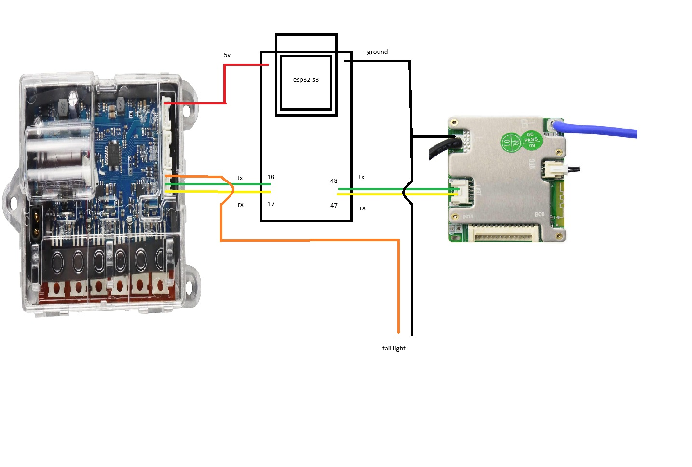

# ESP32-S3 M365-to-JBD BMS Bridge

ESP32-S3 firmware that links an M365 scooter controller to a JBD battery management system.
The device provides a browser-based dashboard, Wi-Fi configuration, OTA updates, and M365-specific battery settings.

## Table of contents

- [Features](#features)
- [Architecture](#architecture)
- [Quick start](#quick-start)
- [Web UI Overview](#web-ui-overview)
  - [Main dashboard](#main-dashboard)
  - [Settings page](#settings-page)
  - [M365 scooter page](#m365-scooter-page)
- [Pages](#pages)
- [Hardware](#hardware)
- [Notes](#notes)
- [Code structure](#code-structure)
- [License](#license)

## Features

- Real-time JBD BMS telemetry for pack voltage, current, SOC, cycles, cell voltages, and temperatures.
- Browser UI with live status, settings, and M365 bridge controls.
- Built-in access point mode plus optional connection to an existing Wi-Fi network.
- OTA firmware updates when OTA is enabled in settings.
- EEPROM-backed persistence and restore defaults support.
- Compatibility mode for larger packs with 10-cell emulation.

## Architecture

The ESP32-S3 bridges two UART channels:

- `UART2` connects to the JBD BMS for pack and cell telemetry.
- `UART1` connects to the M365 scooter controller for bridge communication.

The device serves web pages locally and can operate as a Wi-Fi AP or join an existing network.



## Quick start

1. Install PlatformIO in VS Code or via the PlatformIO CLI.
2. From the project root, build the firmware:

```bash
platformio run -e esp32s3
```

3. Upload to the ESP32-S3:

```bash
platformio run -e esp32s3 -t upload
```

4. Power the device, connect to AP `M365toJBD` with password `12345678`, then open `http://192.168.4.1/`.

## Web UI Overview

### Main dashboard

- Live bridge status and battery metrics.
- Pack voltage, current, state-of-charge, and cycle count.
- Protection and balancing status, detailed cell voltages, and NTC temperatures.
- Automatic refresh keeps the display current.


### Settings page

- Configure device name and hostname.
- Set AP credentials or connect to an existing Wi-Fi network.
- Enable OTA updates and adjust warning thresholds.
- Reset stored settings and restart into AP mode.


### M365 scooter page

- Enter the battery pack serial and choose the scooter UART baud rate.
- Tune polling interval and retry count for scooter/BMS communication.
- Configure per-cell warning and critical voltage thresholds.
- Enable 10-cell mapping for larger battery packs.


## Pages

- `/` — main dashboard
- `/settings` — Wi-Fi, AP, OTA, and BMS warning configuration
- `/m365-scooter` — M365 bridge and pack settings
- `/ota` — OTA firmware upload (visible when OTA is enabled)

## Hardware

- Target: `esp32-s3-devkitc-1`
- JBD UART: `UART2` (`RX=47`, `TX=48`, `9600` baud)
- M365 UART: `UART1` (`RX=17`, `TX=18`)

## Notes

- The default M365 bridge baud rate is `115200`.
- Reset defaults if the device fails to connect after configuration changes.
- The M365 page uses per-cell thresholds for standard 10s pack operation.

## Code structure

- `src/main.cpp` — application startup and main loop
- `src/globals.h` — shared settings and state definitions
- `src/bms.cpp` / `src/bms.h` — JBD BMS decoding and data mapping
- `src/wifi_network.cpp` / `src/wifi_network.h` — Wi-Fi, AP, and OTA management
- `src/persistence.cpp` / `src/persistence.h` — EEPROM persistence and reset logic
- `src/webui.cpp` / `src/webui.h` — HTML generation and HTTP routes

## License

Licensed under the MIT License. See `LICENSE` for details.
