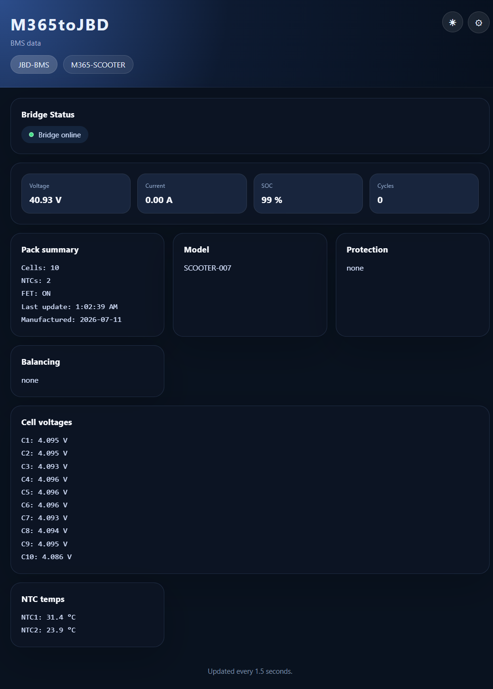
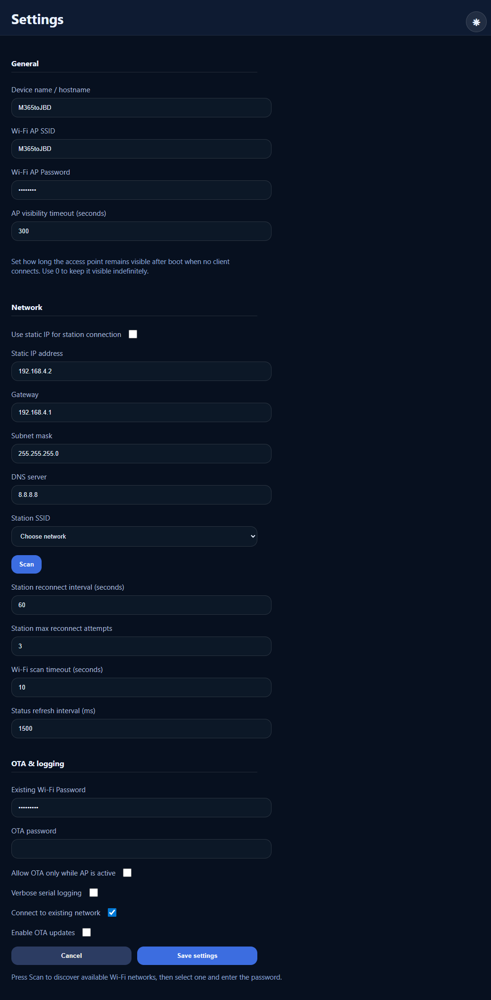
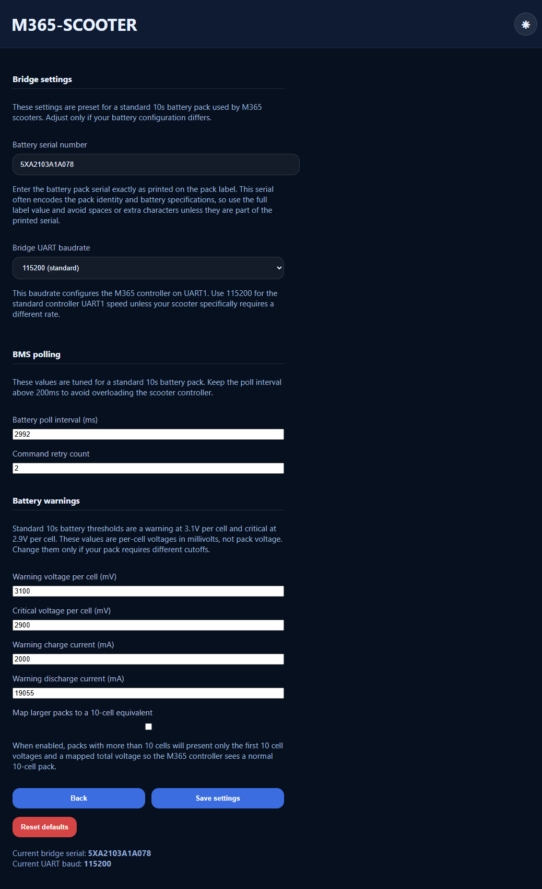

# ESP32-S3 M365-to-JBD BMS Bridge

This project runs on an ESP32-S3 and bridges M365 scooter controller UART1 traffic with a JBD BMS.
It provides a web UI for status, Wi-Fi/AP configuration, OTA uploads, and M365 battery settings.

## Features

- Connects to JBD BMS via UART2 and reads battery/cell status
- Serves a web UI for live status and configuration
- Supports AP mode with default SSID `M365toJBD` and password `12345678`
- Supports optional connection to an existing Wi-Fi network
- OTA update page when enabled in settings
- M365 scooter settings page for battery serial and UART1 baud rate
- Optional "map larger packs to 10-cell equivalent" mode for M365 compatibility
- EEPROM persistence for Wi-Fi and M365 settings
- Reset defaults button to restore stored settings and return to AP mode

## Hardware

- Target: `esp32-s3-devkitc-1`
- JBD UART: `UART2` on pins `RX=47`, `TX=48` at `9600` baud
- M365 UART: `UART1` on pins `RX=17`, `TX=18`

## Build & Upload

This is a PlatformIO Arduino project.

```bash
cd e:/testting-bms
platformio run --environment esp32s3
platformio run --environment esp32s3 --target upload
```

## Usage

1. Boot the device.
2. Connect to Wi-Fi SSID `M365toJBD` with password `12345678`.
3. Open `http://192.168.4.1/` in your browser.
4. Configure Wi-Fi, OTA, and M365 settings from the web UI.

## Web UI Overview

### Main dashboard
- Live bridge status and battery metrics.
- Voltage, current, state-of-charge, and cycle count.
- Pack summary, fault/protection state, balancing status, cell voltages, and NTC temperatures are updated continuously.



### Settings page
- Device name / hostname.
- AP SSID/password and optional station network selection.
- OTA enable toggle for remote firmware upload.
- Warning/critical voltage thresholds and charge/discharge limits.
- Reset defaults button restores EEPROM settings and restarts in access point mode.



### M365 scooter page
- Battery pack serial number and UART baud selection.
- Bridge polling interval and retry count for scooter/BMS communication.
- Per-cell warning and critical voltages for 10s pack emulation.
- `Map larger packs to a 10-cell equivalent` mode for compatibility with non-standard packs.



## Settings Pages

- `/settings`: Wi-Fi/AP and OTA configuration
- `/m365-scooter`: M365 UART1 baud and battery serial configuration
- `/ota`: OTA firmware upload (enabled only when OTA is turned on)

## Notes

- Default standard M365 UART baud rate is `115200`.
- The scooter page allows mapping a larger battery pack to a 10-cell equivalent so the M365 controller sees a normal pack.
- If the device fails to connect, use the reset button on `/settings` to restore defaults.

## Source Organization

- `src/main.cpp` — application entry, setup, and loop
- `src/globals.h` — shared structures and global state
- `src/bms.h` / `src/bms.cpp` — JBD decoding and M365 data mapping
- `src/wifi_network.h` / `src/wifi_network.cpp` — Wi-Fi/AP and OTA setup
- `src/persistence.h` / `src/persistence.cpp` — EEPROM load/save/reset logic
- `src/webui.h` / `src/webui.cpp` — HTML page rendering and web routes

## License

This project is licensed under the MIT License. See the `LICENSE` file for full terms.
